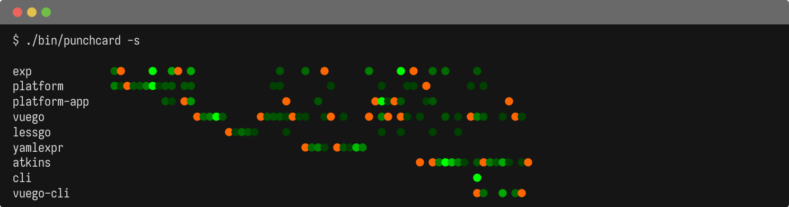

## Hi there 👋

I'm a systems architect and engineer. I work with Go professionally over
10 years. I'm currently working on several open source projects pinned
below. My experience is extensive, and my focus for 2026 is to make web
development experiences with Go without reaching for the Node runtime.

I'm currently working on the following projects:

(Legend: orange marks a repository becoming most active).

My biggest goal in my current efforts is to make Go a friendly language
for website development, with advancements over the experience of PHP or
NodeJS projects. For this purpose I'm writing the [Vuego template
engine](https://github.com/titpetric/vuego) and provide [The Vuego
Tour](https://vuego.incubator.to) for people to play with the VueJS
inspired syntax.

Generally I'm working on:

- Development tooling, code static analysis
- Foundational packages, platforms, system design
- Database driven APIs and interactions, SQL schema design
- Event driven systems and queues, distributed workers
- Supporting command runner for testing, CI/CD, automation
- Docker and docker adjacent delivery / deployment methods
- Engineering leadership with solid technical foundations
- Philosophy on ways of working with people or LLMs, process
- Architectural, structural and strategic practices

I like terminals but I consider web to be what people use. Using the
terminal is fine for automation, but in general, people just want the
good UX and DX experiences, and I try hard to make those happen.

Open to work, reach out if interested. The e-mail is on the left.